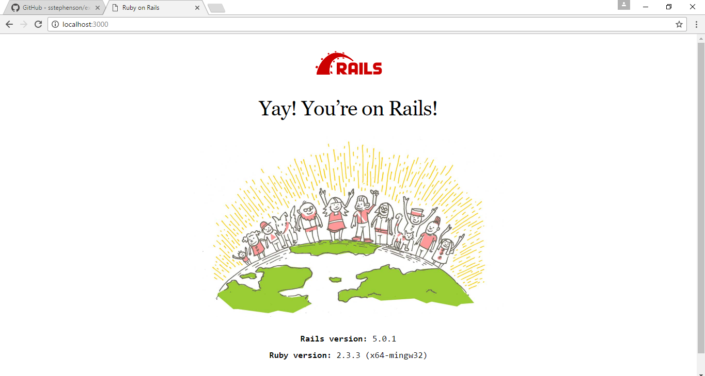

# hello_app


**Rails 框架**

MVC 和 REST、生成器、迁移、路由，以及嵌入式 Ruby


**生成Rails框架**
```
$ gem install rails -v 5.0.1
```

**hello_app**

生产框架
```
$ mkdir workspace
$ cd workspace/
$ rails _5.0.1_ new hello_app

```

gemfile
```ruby
source 'https://rubygems.org'
gem 'rails', '5.0.1'
gem 'puma', '3.4.0'
gem 'sass-rails', '5.0.6'
gem 'uglifier', '3.0.0'
gem 'coffee-rails', '4.2.1'
gem 'jquery-rails', '4.1.1'
gem 'turbolinks', '5.0.1'
gem 'jbuilder', '2.4.1'
group :development, :test do
gem 'sqlite3', '1.3.12'
gem 'byebug', '9.0.0', platform: :mri
end
group :development do
gem 'web-console', '3.1.1'
gem 'listen', '3.0.8'
gem 'spring', '1.7.2'
gem 'spring-watcher-listen', '2.0.0'
end
group :production do
gem 'pg', '0.18.4'
end
# Windows does not include zoneinfo files, so bundle the tzinfo-data gem
gem 'tzinfo-data', platforms: [:mingw, :mswin, :x64_mingw, :jruby]

```

启动服务

```ruby
$ cd hello_app/
$ bundle install

Fetching source index for https://rubygems.org/

```

在本地设备中运行 Rails 服务器
```ruby
$ cd ~/workspace/hello_app/
$ rails server

=> Booting Puma
=> Rails application starting on http://localhost:3000
=> Run `rails server -h` for more startup options
=> Ctrl-C to shutdown server
```

初始首页


